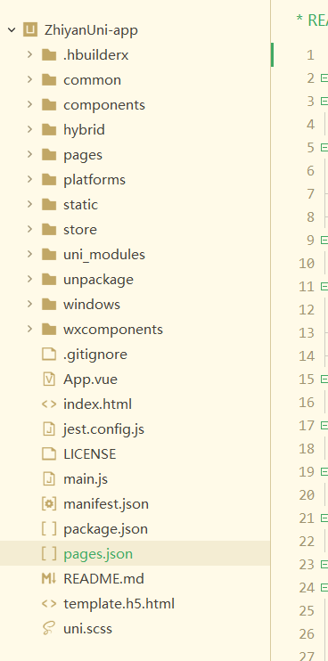

## 移植设计

### 移植业务思路

简化重而且使用频率不高的功能，而且着重管理，展示，提醒，操作个人数据，不扩大到全体的数据进行处理

移植后的项目保持当初MVP版本上的进一步简化，基于已有项目的资源（接口、业务规则、认证体系）最大化复用，聚焦核心功能做轻量化适配，优先保障稳定性和移动端体验

首先，前后端开发的思路不变，安卓 APP 本质上和之前的 Vue 前端一样，都是作为 “客户端” 向后端 SpringBoot 服务（部署在服务器上）发起 HTTP/HTTPS 请求，后端负责处理业务逻辑、操作数据库并返回数据，APP 仅负责数据展示、用户交互和请求封装

最低支持Android 8.0

### 需要移植的业务

移动端优先移植以下侧重**个人内容操作，随时任务处理，团队协作响应，实时提醒**的场景

- 用户与权限服务
  - 不移植OAuth2，但是其他内容都要按正常情况下移植
  - 个人信息部分完全移植，2FA不在手机上给出启用的位置
  - 主页按需要重构，着重于提醒
- 项目部分
  - 项目广场只查看个人参与的任务
  - 项目操作日志保留，方便随时查看其他人在项目内的操作，不需要仪表盘
  - 能够处理对成员的管理操作（邀请，管理员变更）
  - 保留编辑项目和删除项目
- 任务部分
  - 可以新建任务，编辑任务，删除任务
  - 可以接取任务，提交任务，提交后也可以更改提交，可以分配任务
  - 可以审核任务
  - 总之，任务部分要移植的差不多
- 知识库部分
  - 整个知识库部分不在移动端有所体现
- AI实验分析助手
  - 仅移植AI实验分析助手，而且保留基本功能
  - 整个AI产出，项目到任务到成果生成内容这一打通业务目前不移植
- 我的活动
  - 我的任务全部移植
  - 任务统计看情况
  - 我的操作日志需要移植
- 消息部分
  - 全部移植，移动端的侧重是消息的处理

### 接口梳理与适配

## 移植架构

### 技术架构

使用 uni-app，因为 uni-app 基于 Vue 语法，可以复用目前的前端思路

| 维度         | 选型                                                         | 思路                                                         |
| ------------ | ------------------------------------------------------------ | ------------------------------------------------------------ |
| 基础框架     | uni-app（Vue3 + Vite）                                       | Vue3 语法更简洁，Vite 编译速度快，适配 uni-app 最新生态      |
| 状态管理     | Pinia（替代 Vuex）                                           | 轻量、易用，适配 Vue3，适合简化版 APP 的状态管理（如用户信息、全局配置） |
| 网络请求     | uni.request（封装）/uRequest（第三方封装库）                 | uni.request 是 uni-app 内置 API，封装后可统一处理 token、异常；uRequest 更易用 |
| 本地存储     | uni.setStorageSync/uni.getStorageSync（轻量）/uni-app 本地数据库（可选） | 适配多端的本地存储方案，替代原生安卓的 SharedPreferences/Room |
| UI 组件库    | uView Plus（Vue3 版）/uni-ui                                 | 适配 uni-app 的移动端 UI 组件库，包含底部 Tab、列表、表单等核心组件，开箱即用 |
| 原生能力调用 | uni-app 内置 API（如 uni.scanCode、uni.getLocation）         | 无需原生开发，直接调用扫码、定位、相册等能力，跨端兼容       |

### 项目架构

目录

- `pages`：页面文件（对应原项目的`views`，存放页面的 Vue 组件）项目的所有页面都放在这里，每个页面对应一个子文件夹，需在`pages.json`中配置路由，对应原 Vue2 项目的`views`
- `components`：公共组件，可复用的 UI 组件（对应原项目的`components`，这个不变）
- `static`：静态资源（图片、字体等，对应原项目的`assets`）分开的css放在这里
- `common`：公共工具 / 常量（对应原项目的`utils`）存放各种工具 js
- `store`：状态管理（对应原项目的`store`，这个不变）
- `hybrid`：用于存放**原生混合开发的资源**（比如 App 端的原生页面、插件，Web 端一般用不到）。
- `platforms`：**各平台的专属配置 / 代码**（比如微信小程序的`app.json`、App 端的原生插件，实现跨平台差异化开发）。
- `uni_modules`：uni-app 的**插件 / 模块市场下载的依赖**（比如 UI 组件库、工具类插件，自动管理依赖版本）。
- `unpackage`：**打包输出目录**（运行 / 打包项目后，各平台的编译结果会存在这里，比如微信小程序的代码包、H5 的静态文件）。
- `windows`：Windows 端（Electron）的专属配置 / 资源（仅当项目需要打包为 Windows 桌面应用时用到）。
- `wxcomponents`：**微信小程序的第三方组件**（比如引入微信官方的`weui-wxss`组件，仅在微信小程序平台生效）。

**nvue 是 uni-app 的原生渲染模式**

文件

- `App.vue`：项目入口（对应原项目的`App.vue`）
- `main.js`：项目初始化（对应原项目的`main.js`）
- `pages.json`：页面路由配置（对应原项目的`router/index.js`）
- `manifest.json`：uni-app 项目配置（打包、平台适配等）                                                                                       

重构后结构设计

- `static`：静态资源，分出来的 css 样式

  - `app-plus`是**App 端（iOS/Android）专属的静态资源目录**
  - `web`是**H5 端专属的静态资源目录**，暂时不需要，但是保留

- `components`目录：公用组件或者插件，按 “组件 / 插件名称” 分类

  **统一用 uView 的完整库，而且使用基于 nvue 的组件**，`.nvue`是 uni-app 中**原生渲染模式的页面 / 组件文件**，它的语法、样式（仅支持 flex 布局）和普通`.vue`有差异，且**仅在 App 平台生效**

  - `base`：通用的组件
  - `business`：特定业务中使用到的组件
  - `plugin`：第三方插件

- `hybrid`：先不搞，因为这是用于存放**原生混合开发的资源**（比如 App 端的原生页面、插件，Web 端一般用不到）是否使用原生去搞，不太考虑

- `pages`：页面组件，根据业务域分文件夹

  - `project`：项目广场部分
  - `user`：用户认证，个人信息，我的活动
  - `tasks`：任务部分
  - `AI`：Ai部分
  - `major`：主页，消息，等
  - `error`：错误信息页

- `platforms`：各个平台的专属配置

  - `app-plus`：安卓APP
  - `weixin-app`：微信小程序，目前不搞，仅参考

- `store`：状态管理，不分文件夹，但是分文件，也就是说，不同业务的状态管理的js分成不同的文件

- `uni_modules`：uni-app 的**插件 / 模块市场下载的依赖**（比如 UI 组件库、工具类插件，自动管理依赖版本）。用则动，不用则不动

- `unpackage`：**打包输出目录**，别动

- `Windows`： Windows端（Electron）的专属配置 / 资源（仅当项目需要打包为 Windows 桌面应用时用到）。目前不考虑

- `wxcomponents`：**微信小程序的第三方组件**（比如引入微信官方的`weui-wxss`组件，仅在微信小程序平台生效）。先不搞，保留
